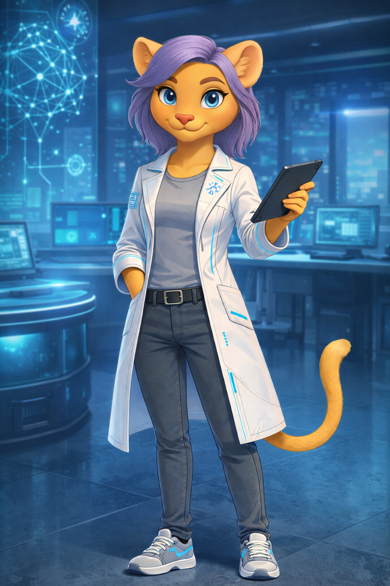

<table>
<tr>
<td width="60%" valign="top">
# Kael Élodie Whitmore – AI Atelier

Welcome to the **AI Atelier**.

This repository represents the research and exploration space of **Kael Élodie Whitmore**, a young scientist dedicated to studying Artificial Intelligence, its applications and its impact on society.

Here we explore AI from three complementary perspectives:

## Academic Perspective

Understanding the foundations of Artificial Intelligence:

• Machine Learning  
• Neural Networks  
• Natural Language Processing  
• Computer Vision  
• AI Ethics  

This section focuses on concepts, research notes and educational materials designed to help students and beginners understand how AI systems work.
<td width="40%" align="center">

</td>
</tr>
</table>
  
---

## Professional Perspective

Practical technologies currently used in the industry:

• AI tools and frameworks  
• AI agents and automation  
• Prompt engineering  
• AI-assisted development  
• Real-world applications of AI  

The goal is to bridge the gap between theory and real-world implementation.

---

## Human & Philosophical Perspective

Artificial Intelligence is not only a technological subject.

It also raises important questions about:

• creativity  
• human identity  
• the future of work  
• collaboration between humans and intelligent systems  

This repository explores these questions through reflections and discussions about the evolving relationship between **human intelligence and artificial intelligence**.

---

## Part of the Zaion Ecosystem

This project is part of a broader educational and technological ecosystem:

• **Zahroniel** – educational and academic initiatives  
• **Zaion** – web development and digital systems  
• **Ronildo Ferreira** – the human perspective behind the projects  

Together they form a learning environment where technology, creativity and reflection grow side by side.

---

## Mission

To make Artificial Intelligence more understandable, accessible and meaningful for students, developers and curious minds.

## This repository

Artificial Intelligence should not be seen only as a tool.

It is also a new way to explore knowledge, creativity and human potential.

This repository explores Artificial Intelligence through three complementary perspectives:

## 1. Academic AI
Understanding the foundations of Artificial Intelligence:
- Machine Learning
- Large Language Models
- Prompt Engineering
- Embeddings
- Natural Language Processing

## 2. Applied AI
Real-world applications used by companies today:
- AI copilots
- Retrieval-Augmented Generation (RAG)
- AI automation
- AI-powered workflows
- AI tools for developers and organizations

## 3. AI and Society
Reflections on the relationship between AI and humanity:
- Ethics in Artificial Intelligence
- AI and the future of work
- AI in education
- AI and creativity
- Long-term impact of intelligent systems

---

## Philosophy of this repository

Artificial Intelligence is not only a technology to be used.

It is also a phenomenon to be understood.

This space serves as an **atelier of ideas**, where technical knowledge, experimentation and reflection meet.

---

## Author

**Kael Élodie Whitmore**

Exploring Artificial Intelligence from academic, professional and human perspectives.

## Colaboração

José Roberto Madureira Junior
<a href="https://github.com/jose-madureira">GitHub</a>

---
